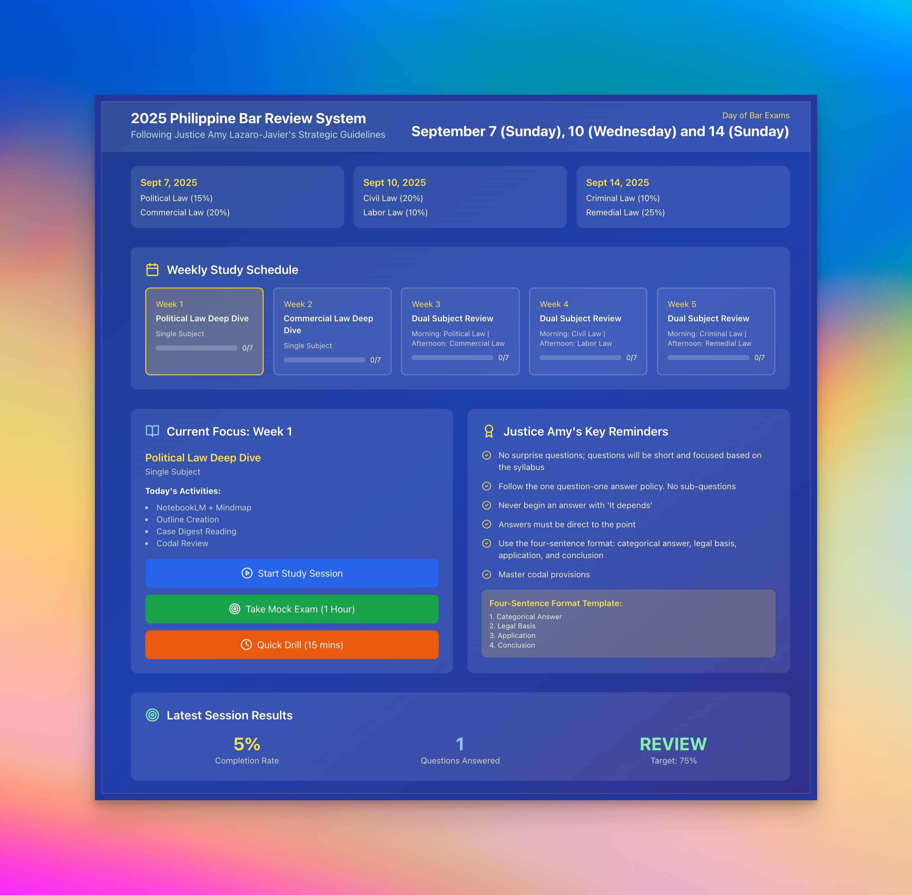

# 2025 Bar Review System Workflows and Scheduling (LEGALBAI)



# Setup Instructions

## Prerequisites
Make sure you have Node.js installed on your Mac/ Linux:
- Download and install Node.js from: https://nodejs.org/
- Verify installation: `node --version` and `npm --version`

## Quick Setup (5 minutes)

### 1. Create the Project Directory
```bash
mkdir bar-review-system-2025
cd bar-review-system-2025
```

### 2. Clone this repo or create file structure:
```bash
mkdir -p src public
```

### 3. Create All Files
Copy the following files to root folder:

- `package.json`
- `tailwind.config.js`
- `postcss.config.js`

**Public folder:**
- `public/index.html`

**Source folder:**
- `src/index.js`
- `src/App.js`
- `src/index.css`

### 4. Install Dependencies
```bash
npm install
```

### 5. Start the Development Server
```bash
npm start
```

The app will automatically open in your browser at `http://localhost:3000`

## Features Available

### 🎯 Mock Exams
- Full 20-question Political Law mock exam (CUSTOMIZE bar questions found at src/App.js)
- Timer functionality (1 hour or 15-minute drills)
- Justice Amy's four-sentence format guidance
- Real-time progress tracking

### 📅 Weekly Study Planner
- Week 1: Political Law deep dive
- Week 2: Commercial Law deep dive
- Week 3-5: Dual-subject format
- Progress tracking per week

### ⚖️ Justice Amy's Guidelines
- Built-in reminders for the four-sentence format
- SPJI-focused questions
- "Never leave questions unanswered" enforcement
- Direct, categorical answer requirements

### 📊 Performance Analytics
- Completion rate tracking
- Pass/fail indicators (75% threshold)
- Session scoring and feedback

## Troubleshooting

### If you get npm install errors:
```bash
npm cache clean --force
rm -rf node_modules package-lock.json
npm install
```

### If Tailwind CSS doesn't load:
```bash
npm install -D tailwindcss postcss autoprefixer
npx tailwindcss init -p
```

### If the app doesn't start:
- Check Node.js version: `node --version` (should be 14+)
- Try: `npm install react-scripts@latest`

## File Structure
```
bar-review-system-2025/
├── public/
│   └── index.html
├── src/
│   ├── App.js
│   ├── index.js
│   └── index.css
├── package.json
├── tailwind.config.js
└── postcss.config.js
```

## Customization

### Adding More Questions
Edit the `politicalLawQuestions` array in `src/App.js` to add more questions following the same format.

### Changing Subjects
Modify the `weeklySchedule` object to adjust your study plan.

### Adjusting Timer
Change the duration parameters in the `startMockExam()` function calls.

## Support
If you encounter any issues, check:
1. Node.js and npm versions
2. All files are in correct directories
3. Dependencies are properly installed

## Update: **[Monday, July 14, 2025; 11:43:56]**

### Here's What's New:
A comprehensive Pomodoro timer system for the Study Session. This will be configurable and follow deep-dive methodology with 90-minute focus blocks and 10-minute breaks. It is configurable with your desired time but ideally, this is recommended time block.

## 🍅 **New Pomodoro Features**

### **⚙️ Configurable Timer Setup**
- **Slider controls** for work duration (25-180 minutes) and break duration (5-30 minutes)
- **Quick presets**: Classic (25+5), Extended (50+10), Deep Dive (90+10), Ultra (120+15)
- **Default**: 90-minute work + 10-minute break (following your deep-dive methodology)

### **⏱️ Full Timer Interface**
- **Large countdown display** with progress bar
- **Pause/Resume/Reset/Stop** controls
- **Round tracking** - shows which study round you're on
- **Total study time** accumulator
- **Visual distinction** between work (blue) and break (green) sessions

### **🔔 Smart Notifications**
- **Browser notifications** when work/break sessions complete
- **Automatic transition** from work to break
- **Manual control** for starting next work session (no auto-restart)

### **💡 Contextual Tips**
During work sessions:
- Focus on one topic at a time
- Use four-sentence format
- Review codal provisions
- Apply Justice Amy's guidelines

During breaks:
- Take a walk outside
- Hydrate
- Light stretching
- Rest eyes
- Healthy snack

### **📊 Session Tracking**
- Shows current focus area (from your weekly schedule)
- Tracks total accumulated study time
- Round counter for motivation

## 🚀 **How It Works**

1. **Click "Start Pomodoro Study Session"**
2. **Configure your preferences** (or use the "Deep Dive" preset)
3. **Start timer** - focuses on your current week's subject
4. **Work session** completes → automatic break starts
5. **Break completes** → choose to start next round or stop

Good luck with your bar review! 🎓⚖️

## Justice Amy's Reminders Built-In:
✅ Four-sentence format enforcement
✅ SPJI questions included
✅ No "it depends" answers
✅ Direct, categorical responses
✅ Never leave questions unanswered